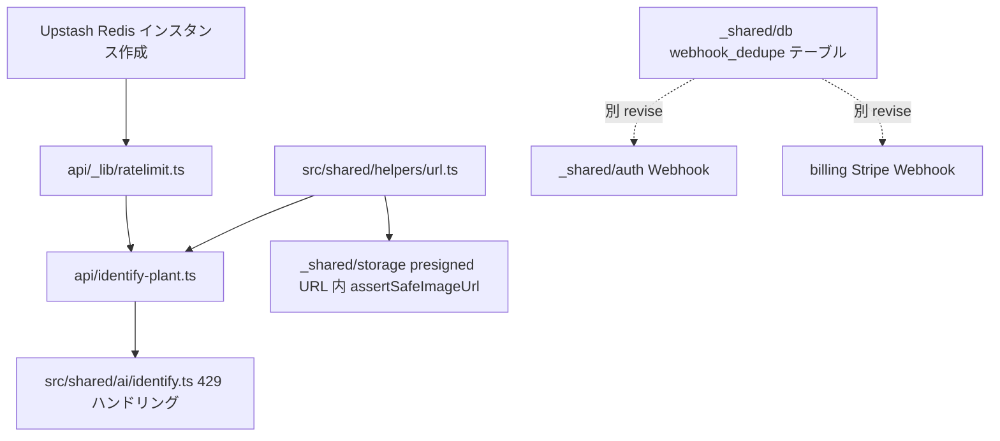

# _shared/ai 変更計画書 (レート制限 + SSRF 防御強化)

> **入力**: [./001_REVISE_SPEC.md](./001_REVISE_SPEC.md), [../../../concept.md](../../../concept.md) §1.4 / §4.3 / §4.6.2, [../../helpers/001_helpers_SPEC.md](../../helpers/001_helpers_SPEC.md), [../../db/001_db_SPEC.md](../../db/001_db_SPEC.md), [../001_ai_SPEC.md](../001_ai_SPEC.md), [../002_ai_PLAN.md](../002_ai_PLAN.md)
> **最終更新**: 2026-05-23

---

## 1. 既存ファイル変更一覧

| ファイル | 変更内容 (概要) | リスク | 関連 SPEC § |
|---|---|---|---|
| `docs/_shared/ai/001_ai_SPEC.md` | §4.1 入力チェックに `validateObjectKey` 追記、§4.2 エラーケースに E-AI-007 (429) 追加、§5.1 NFR に rate limit 上限 4 行追加、§5.2 既存連携に `_shared/helpers/url` + Upstash 追加、§6 security タグ追加 | 中 (SPEC 構造変更) | REVISE_SPEC §2 / §7 |
| `docs/_shared/ai/002_ai_PLAN.md` | §1.2 Vercel Function に `_lib/ratelimit.ts` 追加、§2 Phase 1.5 「Upstash Ratelimit 統合」追加、§4 既存ファイル影響に Upstash env 追加、§6 リスクに rate limit / SSRF 追記 | 中 | REVISE_PLAN §2-5 |
| `docs/_shared/ai/003_ai_UNIT_TEST.md` | §1.2 ハンドラに UT-AI-H10〜H14 (429 / validateObjectKey / Upstash race) 追加、§1.8 helpers/url に新節追加 | 低 | REVISE_UNIT_TEST §1 |
| `docs/_shared/helpers/001_helpers_SPEC.md` | §1 提供 IF に `assertSafeImageUrl` / `validateObjectKey` / `SsrfError` / `ValidationError` 追加、§3 データモデルなし、§4 にエラーケース追加 | 中 (新関数追加、helpers が広く参照されるため影響大) | REVISE_SPEC §7.4 |
| `docs/_shared/db/001_db_SPEC.md` | §1 主要エンティティに `webhook_dedupe` 追加 (id PK, source, received_at, cleanup_idx) | 中 (新規テーブル、Drizzle schema 追加) | REVISE_SPEC §7.3 |
| `docs/PREREQUISITES.md` §9 | Upstash 既記載 (D20260523_017 で追加済) を「実装着手必須」マークに更新 | 低 | REVISE_SPEC §7.5 |

## 2. 新規ファイル一覧

| ファイル | 責務 | 依存 | LOC 見積 |
|---|---|---|---|
| `src/shared/helpers/url.ts` | `assertSafeImageUrl(url): Promise<void>` + `validateObjectKey(key, userId): void` + `SsrfError` / `ValidationError` クラス | `dns` (Node 標準) | ~100 |
| `api/_lib/ratelimit.ts` (Vercel Function 配下) | Upstash Ratelimit インスタンス生成 + middleware ヘルパ `withRateLimit(key, limit, fn)` | `@upstash/ratelimit`, `@upstash/redis` | ~80 |

> 既存 4 文書 (`001_ai_SPEC` / `002_ai_PLAN` / `003_ai_UNIT_TEST` / `INDEX`) は本セッションでは **本サブフォルダ内の改修文書を作るのみ**で直接書き換えない。後続 `/flow:tdd` セッションでこれらを反映 (TDD 着手前に親 SPEC/PLAN/UNIT_TEST に手で追記するか、TDD 内で参照される設計として本フォルダを正とする)。

## 3. 削除ファイル一覧

なし。

## 4. マイグレーション要否

| 項目 | 要否 | 補足 |
|---|---|---|
| DB スキーマ変更 | ✅ (新規テーブル `webhook_dedupe`) | 実装未着手のため、本テーブルは **初回マイグレーション (`_shared/db` 実装時) に同梱**。本セッションで MIGRATION 文書を作成する必要はない |
| 既存データ変換 | ❌ | 既存データなし |
| 設定ファイル変更 | ✅ (`.env.example` に Upstash 系 4 キー追加) | concept §4.5.3 と PREREQUISITES.md §9 で既に列挙済、`.env.example` 実ファイル作成は [SEC-002] (`/flow:tdd _shared/db` 同時消化) で対応 |
| ストレージパス変更 | ❌ | — |

## 5. 実装 Phase 分割 (`/flow:tdd-phase` 連携)

> 本 revise は **既存 `_shared/ai/002_ai_PLAN.md` の Phase 1-4 に対する増分** として組み込む想定。新規 Phase 番号は親 PLAN に追加。

### Phase 1.5 (新規): Upstash Ratelimit 統合
- **対象**: `api/_lib/ratelimit.ts` 新規、`api/identify-plant.ts` middleware 順を §SPEC §7.4 通りに組み立て
- **ゴール**: 同一 uid から 11 req/min 投入で 11 件目が 429 + `Retry-After` ヘッダ
- **依存**: Phase 1 (Vercel Function スケルトン) 完了後
- **テスト**: UT-AI-H10〜H12 (UNIT_TEST §1.2 追加)

### Phase 1.6 (新規): SSRF guard + validateObjectKey
- **対象**: `src/shared/helpers/url.ts` 新規、`api/identify-plant.ts` で `validateObjectKey` 呼出、`_shared/storage` presigned URL 発行内に `assertSafeImageUrl` (defense-in-depth)
- **ゴール**: `imageObjectKey = "../other_user/img.webp"` → 403、`assertSafeImageUrl("http://169.254.169.254/")` → throw
- **依存**: Phase 1 完了後 (Phase 1.5 と並行可能)
- **テスト**: UT-AI-H13〜H14 + UT-HEL-URL-01〜10 (UNIT_TEST §1.8 新節)

### Phase 2-4 (既存): OpenAI 連携 / quota / フロント
- **変更なし** (Phase 1.5, 1.6 完了後に既存通り進行)
- 既存 Phase 4 フロント側 `identifyPlant` に **429 ハンドリング (toast + exponential backoff 3 回)** を追加

## 6. 依存関係順序

## 7. ロールアウト計画

| ステップ | 内容 | 期日 | 検証方法 |
|---|---|---|---|
| 1 | 本 revise 設計反映 (SPEC/PLAN/UNIT_TEST、本セッション) | 2026-05-23 | git commit ハッシュ確認 |
| 2 | TDD 実装 (`/flow:tdd _shared/ai`、Phase 1 → 1.5 → 1.6 → 2 → 3 → 4) | 後続セッション | `npm run test` + Vercel preview deploy |
| 3 | E2E 検証 (`/api/identify-plant` 11 req/min で 429、SSRF URL で 400) | TDD 完了後 | Playwright E2E |
| 4 | α 公開と同時に有効化 | SCENARIO §5 Phase 4 | レート制限 dashboard (Upstash) で実 traffic を観測 |

## 8. リスク・注意点

- **Upstash 無料枠 10k req/日**: DAU 100 想定で 1 ユーザー平均 100 req/日 → ぎりぎり。アラート設定必須 (concept §4.6.2 の check-quota に組み込む)
- **Edge runtime 制約**: `@upstash/ratelimit` は Edge 推奨。Node runtime でも動くが latency 高。Function ごとに runtime 選択が必要
- **DNS rebinding**: `assertSafeImageUrl` で resolve 後 IP チェックを行うが、TOCTOU で resolve と接続の間に IP が変化する攻撃は残る。OpenAI Vision に渡す URL が R2 allowlist 内なら実害は低い (defense-in-depth)
- **Webhook dedupe テーブル成長**: `received_at` インデックス + Vercel Cron で 30 日以上前のレコードを削除する cleanup ジョブが必要 (`_shared/analytics/api/check-quota.ts` と統合検討)
- **既存 002_ai_PLAN.md との二重管理**: 本 revise 内容が親 PLAN にマージされるまで「最新は revise フォルダ」「親 PLAN は旧」の状態。TDD 着手時に親 PLAN を revise 内容で更新するか、TDD で revise を優先参照することを宣言する必要
- **匿名 user の Turnstile (任意)**: §SPEC では MVP 未実装、α 運用で発動条件を判断。本 PLAN では含めない

## 9. 完了の定義 (DoD)

- [ ] 本サブフォルダの 4 文書 (001-004) + INDEX が品質ゲート通過
- [ ] `_shared/ai/001_ai_SPEC.md` の §4 / §5 / §6 に本 revise 内容が反映 (TDD 着手前 or TDD Phase 0 で対応)
- [ ] `_shared/helpers/001_helpers_SPEC.md` に `url.ts` の新関数追加
- [ ] `_shared/db/001_db_SPEC.md` に `webhook_dedupe` テーブル追加
- [ ] concept §8 [論点-011] [論点-013] の status 履歴に「revise 設計反映完了 (commit hash)」を追記、status は `dispatched-to-revise` 維持 (TDD 完了後に `closed` 遷移)
- [ ] `_pending/sec_001-003_rate_limit_ssrf/` を `_pending_archive/` に移動 (revise 完了の signal)
- [ ] SCENARIO §5 cursor 更新 (次の推奨を `/flow:revise _shared/analytics` に進行)

## 10. 更新履歴

| 日付 | 変更概要 | 実行者 |
|---|---|---|
| 2026-05-23 | 初版作成 (`/flow:revise _shared/ai --resume sec_001-003_rate_limit_ssrf`) | /flow:revise |
