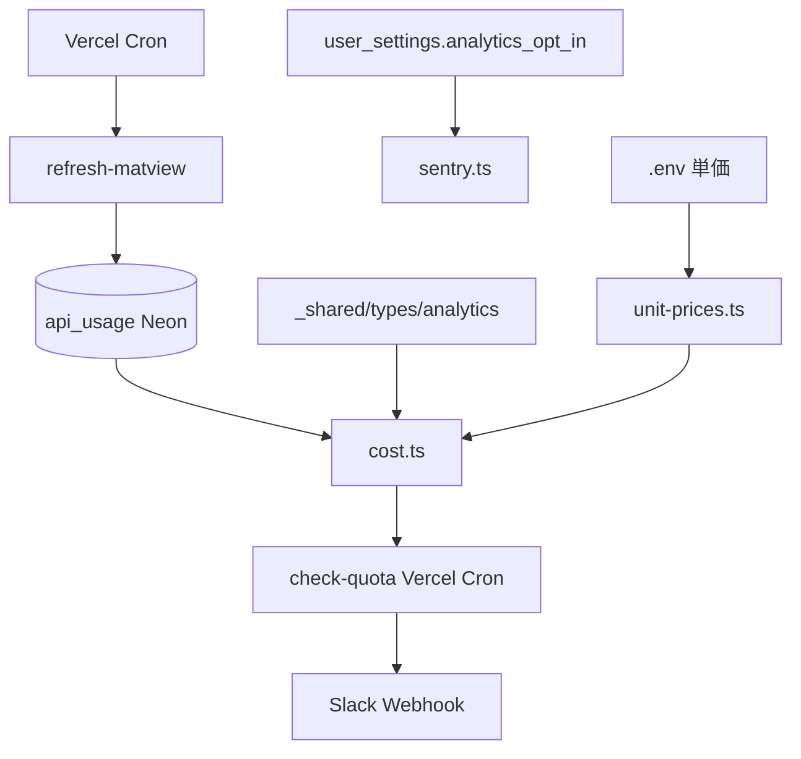

# _shared/analytics 実装計画書

> **入力**: `./001_analytics_SPEC.md`, `../db/001_db_SPEC.md`
> **最終更新**: 2026-05-22 (BaaS Pivot)

---

## 1. 実装対象ファイル一覧

### 1.1 アプリ層 (`src/shared/analytics/`)
| ファイル | 責務 | 依存 | LOC |
|---|---|---|---|
| `sentry.ts` | Sentry init + キャプチャラッパ | @sentry/browser, @sentry/react | ~60 |
| `cost.ts` | api_usage INSERT (Drizzle) + 概算コスト計算 + matview 読み取り | drizzle | ~80 |
| `unit-prices.ts` | .env 単価を型付きで提供 | (なし) | ~30 |
| `index.ts` | barrel | 全 above | ~10 |

### 1.2 Vercel Function (`api/`)
| ファイル | 責務 | LOC |
|---|---|---|
| `check-quota.ts` (Vercel Cron 日次) | OpenAI / R2 / Neon / Clerk / Vercel 使用量集計 + 閾値判定 + Slack Webhook 送信 | drizzle, 各サービス API | ~150 |
| `refresh-matview.ts` (Vercel Cron 日次) | `REFRESH MATERIALIZED VIEW CONCURRENTLY api_usage_monthly` | drizzle | ~30 |

### 1.3 vercel.json (Cron 設定)
```json
{ "crons": [
  { "path": "/api/check-quota", "schedule": "0 4 * * *" },
  { "path": "/api/refresh-matview", "schedule": "0 3 * * *" }
] }
```

### 1.4 マイグレーション
| ファイル | 責務 |
|---|---|
| `0001_api_usage_monthly_matview.sql` | (既に _shared/db PLAN で定義済) |

## 2. 実装 Phase 分割

### Phase 1: cost.ts + unit-prices.ts
- 最重要 (`_shared/ai` の前提)
- ゴール: logApiUsage が api_usage に Drizzle INSERT、getMonthlyUsage がマテビュー読み取り、estimateCost が単価 × トークン

### Phase 2: sentry.ts
- 依存: user_settings.analytics_opt_in 取得 (Drizzle)
- ゴール: opt-in user のエラーが Sentry に届く、opt-out user は送信されない

### Phase 3: check-quota + refresh-matview Vercel Cron
- 日次バッチ + アラート
- ゴール: 閾値超過で Slack に通知、matview が日次 refresh

## 3. 依存関係順序



## 4. 既存ファイル影響
- `.env.example`: COST_* + SLACK_QUOTA_WEBHOOK_URL を追加
- `vercel.json`: Cron Functions 2 件登録

## 5. 横断フォルダ追加・変更
| 横断 | 内容 |
|---|---|
| `_shared/types/analytics.ts` | CostLogEntry, UsageSummary 型 |
| `_shared/db/` | (なし、本 module からスキーマ変更不要、matview は db PLAN で定義) |

## 6. リスク・注意点
- **fail-soft 必須**: logApiUsage 失敗で UI ブロックしない (try-catch + console.error)
- **Slack Webhook URL リーク**: .env 平文管理だが、`.env.local` 専用、リポジトリにコミットしない
- **Sentry user_id**: SHA-256 hash 必須、Clerk user id raw を送らない (個情法対応)
- **matview stale**: 日次 refresh のため当日分は反映遅延あり → リアルタイム集計は別途必要時
- **R2 / Clerk / Neon の使用量取得**: 各 SaaS の Admin API を呼出 → API キーが追加で必要、Vercel env で管理
- **Vercel Cron 信頼性**: Hobby は 2 件まで、Pro は無制限。check-quota と refresh-matview の 2 件で枠 100% 使う → 統合 (1 つの cron で順次実行) でも OK

## 7. DoD
- [ ] cost.ts 全関数 vitest pass
- [ ] sentry.ts opt-in/out 切替動作確認
- [ ] check-quota Vercel Cron を手動実行 → Slack に届く
- [ ] refresh-matview で matview が更新されることを確認
- [ ] Vercel Cron で日次実行確認 (24h 待機 or 手動 trigger)

## 8. 更新履歴
| 日付 | 変更概要 | 実行者 |
|---|---|---|
| 2026-05-22 | 初版作成 (Supabase Edge Fn 前提) | /flow:feature |
| 2026-05-22 | BaaS Pivot: Vercel Cron + Drizzle に書換 | /flow:concept (UPDATE) |
