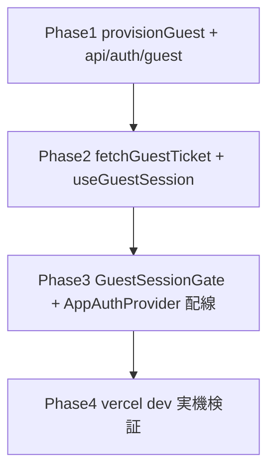

# _shared/auth 変更計画書（匿名サインインを Clerk ticket 方式で実装可能化）

> **入力**: `./001_REVISE_SPEC.md`, `../../concept.md` §4, Step 2 で読んだ実装 (auth-context / ClerkAuthBridge / guest-session / provider / spam-check / ratelimit / main.tsx)
> **最終更新**: 2026-05-25

---

## 1. 既存ファイル変更一覧

| ファイル | 変更内容（概要） | リスク | 関連 SPEC § |
|---|---|---|---|
| `src/shared/auth/index.ts` | `useGuestSession` を export 追加 | 低 | 7.1 |
| `src/app/AppAuthProvider.tsx` | ClerkProvider 内 (ClerkAuthBridge と同階層) に `<GuestSessionGate>` をマウントし boot で `ensureGuestSession` を駆動 | 中 (起動順序) | 7.1 |
| `docs/_shared/auth/001_auth_SPEC.md` | §1.1 `useGuestSession` 説明 + §4.2 E-AU-001 を ticket 方式へ追補 (1 行参照) | 低 | 9 [論点-001] |
| `concept.md` §4 | 「Clerk Guest Users β」→「Clerk + backend 匿名ユーザー発行 (createUser+ticket)」整合修正 (※ /flow:concept で実施) | 低 | 9 [論点-001] |

## 2. 新規ファイル一覧

| ファイル | 責務 | 依存 | LOC 見積 |
|---|---|---|---|
| `api/auth/guest.ts` | 匿名ユーザー発行 endpoint。createUser + users upsert + signInToken。レート制限ガード。純コア (`provisionGuest`) は clerk client / db / limiter 注入で単体テスト可、handler は dynamic import で SDK 隔離 (O35) | `@clerk/backend`, db, `api/_lib/ratelimit` | ~90 |
| `api/auth/_lib/guest-provision.ts` (任意分割) | `provisionGuest({ createUser, createSignInToken, upsertUser, limiter, key })` 純オーケストレーション (createUser→upsert→token、失敗マッピング) | なし (全注入) | ~50 |
| `src/shared/auth/useGuestSession.ts` | React アダプタ。`useSignIn` から `signInAsGuest` を構築 (fetch ticket → `signIn.create({strategy:'ticket'})` → `setActive`) し、`ensureGuestSession` を boot effect で駆動。`useAuthSnapshot().isSignedIn` を渡す | `@clerk/clerk-react` useSignIn, `./guest-session`, fetch | ~70 |
| `src/shared/auth/GuestSessionGate.tsx` | `useGuestSession` を呼ぶだけの無描画 (or fatal モーダル) コンポーネント。ClerkProvider 内専用 | `./useGuestSession` | ~30 |
| `src/shared/auth/guest-client.ts` | `fetchGuestTicket(fetchFn, fingerprint?) => Promise<string>` 純関数 (endpoint 呼び + エラー正規化)。fetch 注入で単体テスト可 | なし | ~30 |

## 3. 削除ファイル一覧

| ファイル | 削除理由 | 代替 |
|---|---|---|
| (なし) | `ensureGuestSession` は不変で再利用 | — |

## 4. マイグレーション要否

- DB スキーマ変更: ❌ (users 既存で充足)
- 既存データ変換: ❌ (α 未公開、prod data なし)
- 設定ファイル変更: ❌ (env は既存 CLERK_SECRET_KEY / Upstash で足りる)
- ストレージパス変更: ❌
→ **MIGRATION ドキュメント不要**

## 5. 実装 Phase 分割（/dev-tdd-phase 連携）

### Phase 1 (RED→GREEN→IMPROVE): バックエンド匿名発行コア + endpoint
- 対象: `api/auth/_lib/guest-provision.ts` (`provisionGuest` 純関数) + `api/auth/guest.ts` (handler、`{fetch:handler}` 形 = handler-contract 準拠)
- ゴール: 注入した createUser/createSignInToken/upsert/limiter で ticket を返す。レート超過 429 / 失敗 503 / fingerprint cap。全分岐を mock 単体テスト

### Phase 2: フロント ticket sign-in アダプタ
- 対象: `src/shared/auth/guest-client.ts` (`fetchGuestTicket`) + `src/shared/auth/useGuestSession.ts`
- ゴール: fetch ticket → `signIn.create({strategy:'ticket'})` → `setActive` を mock した useSignIn で検証。`ensureGuestSession` 経由で single-flight / retry が効くこと

### Phase 3: boot 配線
- 対象: `src/shared/auth/GuestSessionGate.tsx` + `src/app/AppAuthProvider.tsx` 配線 + `index.ts` export
- ゴール: keyあり時に ClerkProvider 内で Gate がマウントされ、isLoaded && !isSignedIn で 1 度だけ `ensureGuestSession` を駆動。keyless 時は従来どおり no-op (バナー)

### Phase 4: runtime 検証 (release Phase 2 再開、TDD 範囲外)
- `vercel dev` + 実 Clerk test 鍵で起動 → 匿名 session 確立 → 撮影→識別→保存→図鑑反映 を実機目視

## 6. 依存関係順序

## 7. ロールアウト計画

| ステップ | 内容 | 期日 | 検証方法 |
|---|---|---|---|
| 1 | unit 実装 (Phase1-3) green | 2026-05-25 | `npm test` 全 green + 新規分岐カバー |
| 2 | ローカル実機目視 (Phase4) | 2026-05-25 | vercel dev で匿名→保存→図鑑 |
| 3 | preview deploy | — | release Phase 3 (Class B) |
| 4 | prod | — | release Phase 3 |

## 8. リスク・注意点

- **Clerk createUser の identifier 要件** ([論点-002]): 完全 identifier 無し作成が拒否される可能性。`externalId` (生成 UUID) 付与で回避、runtime で確定。
- **MAU 濫用**: 匿名 user = Clerk MAU 消費。レート制限必須 (本計画で付与)。fingerprint hard cap の実体化は別 issue。
- **起動順序**: Gate は ClerkProvider 内 + `useSignIn` 利用可能後にマウント。StrictMode の二重 effect は single-flight lock で吸収。
- **`signIn.create({strategy:'ticket'})` の戻り**: `createdSessionId` を `setActive` に渡す。失敗時は E-AU-001 経路。

## 9. 完了の定義 (DoD)

- [ ] Phase 1-3 実装、`npm test` 全 green、新規分岐カバレッジ確保
- [ ] `tsc --noEmit` 0 / eslint 0
- [ ] handler-contract test が `api/auth/guest.ts` を自動カバー (`{fetch}` 形)
- [ ] vercel dev で匿名 session 確立 → 撮影→識別→保存→図鑑反映 を実機確認 (Phase4)
- [ ] `/dev-review` 通過
- [ ] [論点-001] concept §4 / SPEC §1.1 整合修正

## 10. 更新履歴
| 日付 | 変更概要 | 実行者 |
|---|---|---|
| 2026-05-25 | 初版作成 | /flow:revise |
