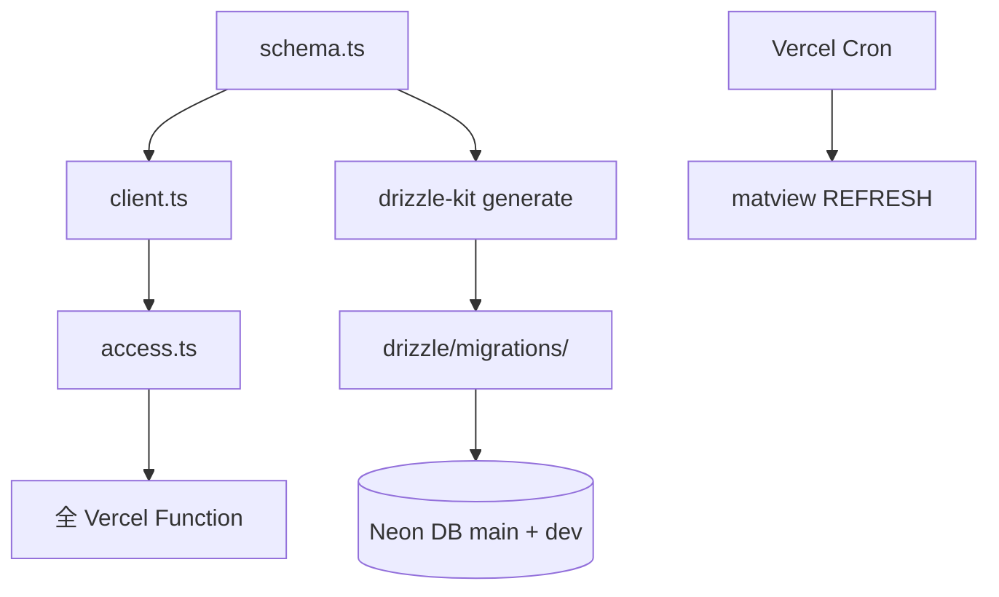

# _shared/db 実装計画書

> **入力**: `./001_db_SPEC.md`, `../../concept.md` §4.3 §4.5
> **最終更新**: 2026-05-22 (BaaS Pivot 反映)

---

## 1. 実装対象ファイル一覧

### 1.1 アプリ層 (`src/shared/db/`)
| ファイル | 責務 | 依存 | LOC |
|---|---|---|---|
| `schema.ts` | 全テーブル + enum + view を Drizzle で定義 | drizzle-orm | ~250 |
| `client.ts` | `db` (neon-http) + `dbPool` (node-postgres) シングルトン | drizzle-orm/neon-http, @neondatabase/serverless | ~40 |
| `access.ts` | withUserScope, assertOwner | (なし) | ~40 |
| `errors.ts` | DbError 型 | (なし) | ~20 |
| `index.ts` | barrel export | 全 above | ~20 |

### 1.2 マイグレーション (`drizzle/migrations/`)
| ファイル | 責務 |
|---|---|
| `0000_initial_schema.sql` | 全テーブル + enum + index 一括作成 |
| `0001_api_usage_monthly_matview.sql` | matview 定義 |
| `0002_append_only_triggers.sql` | billing_unlocks / consent_logs / discovery_edits UPDATE/DELETE 禁止トリガ |

### 1.3 drizzle 設定 (`drizzle.config.ts`)
```ts
import type { Config } from 'drizzle-kit';
export default {
  schema: './src/shared/db/schema.ts',
  out: './drizzle/migrations',
  dialect: 'postgresql',
  dbCredentials: { url: process.env.DATABASE_URL! },
  verbose: true,
  strict: true,
} satisfies Config;
```

### 1.4 npm scripts
```json
{
  "db:generate": "drizzle-kit generate",
  "db:migrate": "drizzle-kit migrate",
  "db:studio": "drizzle-kit studio",
  "db:seed": "tsx db/seed.ts"
}
```

### 1.5 Vercel Cron 設定 (`vercel.json`)
```json
{ "crons": [ { "path": "/api/refresh-matview", "schedule": "0 3 * * *" } ] }
```

## 2. 実装 Phase 分割

### Phase 1: schema + client + 基本 CRUD
- 含む: schema.ts + client.ts + 初回 migration generate + Neon main branch apply
- ゴール: Drizzle Studio で全テーブルが見える、INSERT/SELECT 動作

### Phase 2: access 制御 + 二重防御
- 含む: access.ts + 全 Function での組込み
- ゴール: ユーザースコープが必須化

### Phase 3: matview + append-only triggers
- 含む: 0001 matview + 0002 triggers + Vercel Cron `/api/refresh-matview`
- ゴール: 日次集計動作 + append-only 整合性

### Phase 4: seed + dev branch ワークフロー整備
- 含む: `db/seed.ts` + `neonctl branches create` 手順
- ゴール: 新規開発者が 5 分で dev 環境構築

## 3. 依存関係順序



## 4. 既存ファイル影響
- `package.json`: `drizzle-orm`, `drizzle-kit`, `@neondatabase/serverless`, `pg` 追加
- `.env.example`: `DATABASE_URL=postgresql://...` 追加
- `.gitignore`: `drizzle/.drizzle_kit_local` 等の生成物を除外
- `vercel.json`: Cron 設定追加

## 5. 横断フォルダ追加・変更
| 横断 | 内容 |
|---|---|
| `_shared/types/domain.ts` | Drizzle `InferSelectModel` / `InferInsertModel` re-export |
| `_shared/auth` | Clerk Webhook → users upsert |
| `_shared/storage` | images INSERT |
| `_shared/ai` | discoveries / api_usage 書込 |
| `_shared/analytics` | matview 読込 + Slack 通知 |

## 6. リスク・注意点
- **Neon auto-suspend cold start**: 初回 500ms-1s、UX 「ローディング表示」必須
- **コネクション枯渇**: Neon pooler 必須 (`-pooler` URL)、direct connection は drizzle-kit のみ
- **Append-only trigger**: PostgreSQL `BEFORE UPDATE/DELETE` トリガで `RAISE EXCEPTION`
- **マイグレーション CI**: GitHub Actions で PR ごとに drizzle-kit generate diff チェック
- **本番マイグレーション**: 手動 trigger 推奨 (deploy hook で自動化しない)
- **transaction**: `db.transaction(async (tx) => { ... })`、Webhook 受信時のトランザクション境界注意

## 7. DoD
- [ ] Drizzle schema 全 9 テーブル + 3 enum + 1 matview 定義
- [ ] `drizzle-kit generate` で SQL 自動生成
- [ ] Neon main branch に migration apply 成功
- [ ] withUserScope で他 user の row が SELECT できない
- [ ] billing_unlocks UPDATE 試行 → トリガ拒否
- [ ] consent_logs DELETE 試行 → トリガ拒否
- [ ] Vercel Cron で matview 日次 refresh
- [ ] dev branch 作成 → schema 反映確認

## 8. 更新履歴
| 日付 | 変更概要 | 実行者 |
|---|---|---|
| 2026-05-22 | 初版作成 (Supabase 前提) | /flow:feature |
| 2026-05-22 | BaaS Pivot: Drizzle + Neon に書換 (D20260522-114) | /flow:concept (UPDATE) |
