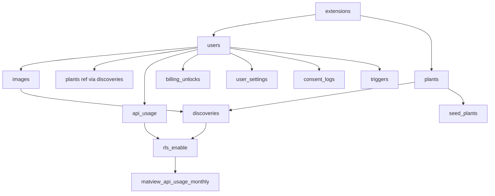

# _shared/db 実装計画書

> **入力**: `./001_db_SPEC.md`, `../../concept.md` §1.4 / §4.3 / §4.5
> **最終更新**: 2026-05-22

---

## 1. 実装対象ファイル一覧

### 1.1 マイグレーション (`supabase/migrations/`)
| ファイル | 責務 | 依存 | LOC 見積 |
|---|---|---|---|
| `20260522_001_extensions.sql` | pgcrypto / uuid-ossp / pg_cron 有効化 | (なし) | ~10 |
| `20260522_002_enums.sql` | discovery_status / billing_sku / consent_doc_type | (なし) | ~20 |
| `20260522_003_users.sql` | public.users + trigger (auth.users 同期) | enums | ~50 |
| `20260522_004_plants.sql` | plants マスタ + index | (なし) | ~30 |
| `20260522_005_images.sql` | images + index | users | ~30 |
| `20260522_006_discoveries.sql` | discoveries + index | users, plants, images | ~50 |
| `20260522_007_api_usage.sql` | api_usage + index | users | ~30 |
| `20260522_008_billing_unlocks.sql` | billing_unlocks + index | users | ~30 |
| `20260522_009_user_settings.sql` | user_settings (1:1 with users) | users | ~30 |
| `20260522_010_consent_logs.sql` | consent_logs + index | users | ~30 |
| `20260522_011_triggers.sql` | set_updated_at() trigger + users sync trigger | users | ~30 |
| `20260522_012_rls_enable.sql` | 全テーブル RLS ON + ポリシー定義 | 全テーブル | ~80 |
| `20260522_013_matview_api_usage_monthly.sql` | マテビュー + refresh function | api_usage | ~40 |
| `20260522_014_seed_plants.sql` | 初期植物マスタ seed (日本の頻出 50 種) | plants | ~100 |

> 合計 LOC: ~560

### 1.2 TypeScript ラッパ (`src/shared/db/`)
| ファイル | 責務 | 依存 | LOC 見積 |
|---|---|---|---|
| `client.ts` | Supabase クライアント生成 (anon / service_role) | `@supabase/supabase-js` | ~30 |
| `types.ts` | re-export from `src/shared/types/supabase.ts` (CLI 生成) | (CLI 出力) | ~5 |
| `index.ts` | barrel export | client + types | ~5 |

### 1.3 シード・スクリプト (`supabase/`)
| ファイル | 責務 | LOC 見積 |
|---|---|---|
| `seed.sql` | 開発時の追加 seed (テスト用 user / discoveries) | ~40 |

## 2. 実装 Phase 分割

### Phase 1 (RED→GREEN→IMPROVE): スキーマ + RLS 基本
- 対象: マイグレーション 001-012、`src/shared/db/client.ts`、`types.ts`
- テスト対象 (UNIT_TEST):
  - 各テーブル CREATE 成功
  - RLS が ON、ポリシーが正しく適用される
  - 匿名 user で users INSERT 成功、他 user のデータ参照不可
- ゴール: マイグレーション適用 → 型生成 → クライアント生成まで通る

### Phase 2: マテビュー + 集計関数
- 対象: マイグレーション 013、refresh function
- テスト対象: マテビュー の SELECT 動作、refresh 後の集計値正しさ

### Phase 3: Seed データ
- 対象: マイグレーション 014、`supabase/seed.sql`
- テスト対象: `supabase db reset` で seed 適用、plants 50 件 SELECT 成功

## 3. 依存関係順序

## 4. 既存ファイルへの影響

(初版のため影響なし。既存マイグレーションがあれば調整するが、今回は新規)

## 5. 横断フォルダへの追加・変更

| 横断フォルダ | 追加・変更内容 |
|---|---|
| `_shared/types/` | Supabase CLI が `src/shared/types/supabase.ts` を自動生成 (Phase 1 完了後 `supabase gen types typescript --local`) |
| `_shared/auth/` | (本 module 完了後に着手) client.ts を import して `auth.uid()` 参照 |

## 6. リスク・注意点

- **RLS 評価コスト**: 高頻度書込テーブル (api_usage) では RLS による slowdown 注意。インデックスで緩和。
- **マテビュー refresh タイミング**: pg_cron で日次実行する案 vs Edge Function で集計バッチを別途持つ案。本 PLAN では pg_cron を採用 (Supabase Free でも利用可)。負荷次第で Phase 4 移行を判断。
- **匿名 user の大量増殖**: [論点-006] で SPAM 抑止策が未確定。本 module では制約しないが、users.is_anonymous の集計クエリを `account` 機能で監視可能にしておく。
- **PII 取扱い**: ip_hash は SHA-256 で hash 化、salt を `.env` 管理 (rotation 計画は別途)。
- **マイグレーション逆方向**: 開発フェーズは `db reset` で対応、本番デプロイ前に rollback 戦略を別途検討 (Supabase は up のみサポート、down は手動 SQL)。

## 7. 完了の定義 (DoD)

- [ ] 全マイグレーション (001-014) が順次適用成功
- [ ] `supabase gen types typescript --local` で `src/shared/types/supabase.ts` 生成成功
- [ ] 全テーブルで RLS が ON 確認、ポリシーが意図通り
- [ ] UNIT_TEST 全パス (RLS 検証含む)
- [ ] **cross-cutting のため E2E_TEST は本 module 単体では持たない**。統合テストは依存機能 (capture / notebook / billing 等) 側 E2E でカバー
- [ ] `supabase db reset` でフレッシュ環境 → seed → 全テーブル SELECT が動く
- [ ] `/dev-review` 通過、PR (`/dev-pr`) マージ可能状態

## 8. 更新履歴
| 日付 | 変更概要 | 実行者 |
|---|---|---|
| 2026-05-22 | 初版作成 | /flow:feature |
