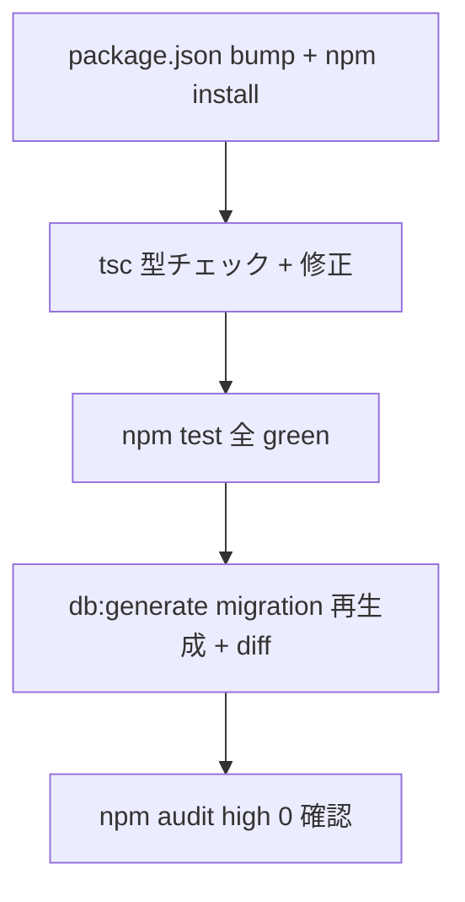

# _shared/db 変更計画書（drizzle-orm SQL インジェクション CVE 対応）

> **入力**: `./001_REVISE_SPEC.md`, `../../concept.md` §3 NFR / §5.1, Step 2 で読んだ `src/shared/db/*.ts`
> **最終更新**: 2026-05-24

---

## 1. 既存ファイル変更一覧

| ファイル | 変更内容（概要） | リスク | 関連 SPEC § |
|---|---|---|---|
| `package.json` | `drizzle-orm` `^0.36.4`→`^0.45.2`、`drizzle-kit` `^0.30.1`→最新安定 | 低 | §2.2 |
| `package-lock.json` | `npm install` で再生成 (drizzle 系 high+moderate 解消) | 低 | §2.2 |
| `src/shared/db/schema.ts` | **変更想定なし**。0.45 で型エラーが出た場合のみ最小修正 (column builder API は安定) | 低 | §3.1 |
| `src/shared/db/client.ts` | **変更想定なし**。neon-http / node-postgres adapter シグネチャ確認 | 低 | §3.1 |
| `src/shared/db/access.ts` | **変更なし** (drizzle 内部 API 非依存、純 TS) | なし | §7.4 |
| `drizzle/migrations/*` | `npm run db:generate` で再生成 → 既存 DDL と diff、等価確認 | 低 | §2.3 |

## 2. 新規ファイル一覧

| ファイル | 責務 | 依存 | LOC 見積 |
|---|---|---|---|
| (なし) | — | — | — |

## 3. 削除ファイル一覧

| ファイル | 削除理由 | 代替 |
|---|---|---|
| (なし) | — | — |

## 4. マイグレーション要否

- DB スキーマ変更: ❌ (`schema.ts` 不変)
- 既存データ変換: ❌
- 設定ファイル変更: ✅ (`package.json` / lockfile のみ)
- ストレージパス変更: ❌
- **migration ファイル再生成**: △ — データ移行ではなく、drizzle-kit 新バージョンが同一 `schema.ts` から生成する DDL の**等価性検証**のみ。差分が出たら意味的に等価か確認 (formatting 差は許容、DDL セマンティクス変化は要精査)。→ 005_MIGRATION 不要 (本 PLAN §4 + 004 検証計画でカバー)

## 5. 実装 Phase 分割（/dev-tdd-phase 連携）

### Phase 1 (RED→GREEN→IMPROVE): 依存アップグレード + 互換性確認
- 対象: `package.json` / `package-lock.json` / `src/shared/db/*.ts` (型エラー発生時のみ)
- 手順:
  1. `npm install drizzle-orm@^0.45.2 drizzle-kit@latest`
  2. `npx tsc --noEmit` で型エラー検出 → 発生分のみ `_shared/db` 内で最小修正
  3. `npm test` 実行 → 既存 28 (_shared/db) + 全 373 が green であることを確認 (RED が出たら GREEN へ)
- ゴール: 全 Vitest green 維持 + 型エラーゼロ

### Phase 2: migration 再生成 + DDL 等価検証
- 対象: `drizzle/migrations/`
- 手順:
  1. `npm run db:generate` で migration SQL 再生成
  2. 既存 migration と diff → DDL セマンティクス等価を確認
  3. (任意) Neon dev branch で `npm run db:migrate` 適用検証
- ゴール: DDL 等価 + (dev branch) apply 成功

### Phase 3: セキュリティ検証
- 手順: `npm audit` 実行 → GHSA-gpj5-g38j-94v9 (high) が消失していることを確認。残 moderate (vite/vitest 系) は Phase 3.5 bootstrap 対象として許容
- ゴール: `npm audit` high 0 件、§8 [論点-015] closed 化

## 6. 依存関係順序

## 7. ロールアウト計画

| ステップ | 内容 | 期日 | 検証方法 |
|---|---|---|---|
| 1 | 開発ブランチで upgrade + test green | Phase 4 前 | `npm test` 373/373 |
| 2 | `npm audit` clean (high 0) | 同上 | audit 出力 |
| 3 | コミット (本番未公開のため即反映可) | 同上 | git log |

## 8. リスク・注意点

- drizzle-orm 0.x はマイナーで破壊的変更が入る慣行 → 型エラー発生時は変更ログ (drizzle GitHub releases 0.37〜0.45) を確認
- `drizzle-kit` メジャー bump で `drizzle.config.ts` のスキーマが変わる可能性 → config 確認
- neon-http / node-postgres adapter のシグネチャ変更がないか `client.ts` で確認 (現状 `drizzle(client, { schema })` 形式、安定)

## 9. 完了の定義 (DoD)

- [ ] `drizzle-orm@^0.45.2` 以上 + `drizzle-kit` 最新で `npm install` 成功
- [ ] `npx tsc --noEmit` 型エラーゼロ
- [ ] `npm test` 全 Vitest green (373/373 維持)
- [ ] `npm run db:generate` で migration 再生成、DDL 等価確認
- [ ] `npm audit` で GHSA-gpj5-g38j-94v9 (high) 消失
- [ ] §8 [論点-015] status → closed (対応 commit リンク)
- [ ] `/dev-review` 通過 (任意)

## 10. 更新履歴
| 日付 | 変更概要 | 実行者 |
|---|---|---|
| 2026-05-24 | 初版作成 | /flow:revise (D20260524_044) |
