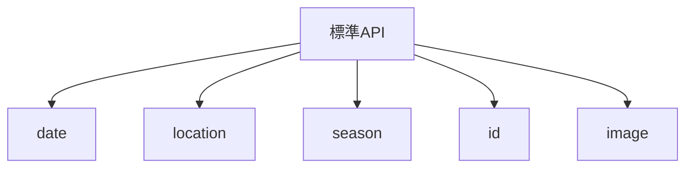

# _shared/helpers 実装計画書

> **入力**: `./001_helpers_SPEC.md`
> **最終更新**: 2026-05-22

---

## 1. 実装対象ファイル一覧 (`src/shared/helpers/`)

| ファイル | 責務 | 依存 | LOC 見積 |
|---|---|---|---|
| `date.ts` | 日付フォーマット / 計算 | (なし、純標準) | ~80 |
| `image.ts` | WebP 変換 / EXIF 削除 / thumbnail | browser-image-compression (or 純 Canvas) | ~120 |
| `location.ts` | 座標丸め / navigator.geolocation ラッパ | (なし) | ~60 |
| `season.ts` | 季節判定 | (なし) | ~50 |
| `id.ts` | UUID / SHA-256 | crypto.subtle | ~40 |
| `index.ts` | barrel | 全 above | ~10 |

## 2. 実装 Phase 分割

### Phase 1: pure helpers (date / location / season / id)
- 副作用ゼロ、テスト容易
- ゴール: vitest で全関数 100% カバレッジ

### Phase 2: image (ブラウザ依存)
- Canvas API + EXIF strip ライブラリ調査
- ゴール: 実機 (Chrome / Safari) で動作確認

## 3. 依存関係順序

並列実装可能 (相互依存なし)。

## 4. 既存ファイル影響
なし。

## 5. 横断フォルダ追加・変更
`_shared/types/domain.ts` に `LatLng = {lat: number, lng: number}` 型を追加 (本ヘルパが import)。

## 6. リスク・注意点
- **iOS Safari Geolocation**: HTTPS 必須、user gesture 必要 (起動時自動取得は不可)
- **Canvas Memory**: 大きな画像で OOM 注意、入力サイズチェック必須 (concept §3 NFR: 10MB 上限)
- **crypto.subtle**: HTTPS 必須 (localhost は許可)

## 7. DoD
- [ ] 全関数 vitest pass
- [ ] image.ts は実機 Chrome / Safari で動作確認
- [ ] tsc strict pass

## 8. 更新履歴
| 日付 | 変更概要 | 実行者 |
|---|---|---|
| 2026-05-22 | 初版作成 | /flow:feature |
