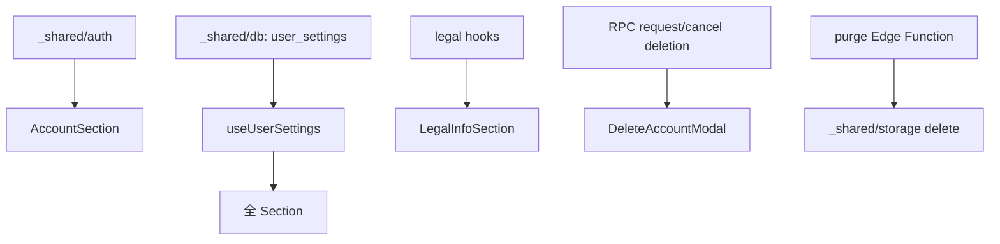

# account 実装計画書

> **入力**: `./001_account_SPEC.md`, `../_shared/auth/001_auth_SPEC.md`
> **最終更新**: 2026-05-22

---

## 1. 実装対象ファイル一覧

### 1.1 アプリ層 (`src/features/account/`)
| ファイル | 責務 | LOC |
|---|---|---|
| `pages/SettingsPage.tsx` | 設定画面のルート、6 section 並列 | ~150 |
| `pages/OAuthCallback.tsx` | redirect 戻り処理 (handleOAuthCallback 呼出) | ~50 |
| `pages/DeletionPendingGate.tsx` | 削除予約中 user の起動時 gate | ~60 |
| `components/AccountSection.tsx` | OAuth ステータス + リンク/ログアウトボタン | ~80 |
| `components/LocationPrecisionSection.tsx` | 位置情報ラジオ | ~50 |
| `components/AiConsentSection.tsx` | AI 同意トグル + 注意書き | ~60 |
| `components/PrivacySection.tsx` | エラー協力 + 削除ボタン | ~80 |
| `components/LegalInfoSection.tsx` | 同意状況表示 (legal から hook 借りる) | ~50 |
| `components/DataManagementSection.tsx` | エクスポートリンク + 削除ボタン | ~60 |
| `components/DeleteAccountModal.tsx` | 二段階削除モーダル | ~120 |
| `components/RestoreAccountModal.tsx` | 削除予約取消モーダル | ~60 |
| `hooks/useUserSettings.ts` | user_settings の fetch / upsert | ~70 |
| `hooks/useDeletionStatus.ts` | deleted_at 監視 | ~40 |
| `lib/accountApi.ts` | request_account_deletion, cancel_account_deletion RPC ラッパ | ~50 |
| `index.ts` | barrel | ~10 |

### 1.2 ルーティング (`src/app/router.tsx`)
| ルート | コンポーネント | 認証 |
|---|---|---|
| `/account/settings` | SettingsPage | 認証必須 |
| `/auth/callback` | OAuthCallback (実装は account 配下) | 認証必須 |

### 1.3 マイグレーション
| ファイル | 責務 |
|---|---|
| `20260522_022_users_deletion.sql` | users に deleted_at, deletion_reason 追加 |
| `20260522_023_rpc_account_deletion.sql` | request_account_deletion / cancel_account_deletion RPC |
| `20260522_024_user_settings_columns.sql` | user_settings に location_precision, ai_consent_revoked_at, analytics_opt_in 追加 |

### 1.4 Edge Function
| ファイル | 責務 |
|---|---|
| `supabase/functions/purge-deleted-users/index.ts` | 30 日経過 user を完全削除 (cron) |

### 1.5 cron
| ファイル | 責務 |
|---|---|
| `supabase/migrations/20260522_025_pg_cron_purge.sql` | pg_cron で daily purge 実行 |

## 2. 実装 Phase 分割

### Phase 1: 設定画面スケルトン + user_settings 表示
- 含む: SettingsPage, useUserSettings (fetch のみ), 各 Section の表示のみ

### Phase 2: 設定値の更新 (位置情報精度 / AI 同意 / プライバシー)
- 含む: upsert ロジック、optimistic update

### Phase 3: OAuth リンク UI
- 含む: AccountSection, OAuthCallback, _shared/auth との連携

### Phase 4: アカウント削除 (二段階 + grace period)
- 含む: DeleteAccountModal, accountApi RPC, DeletionPendingGate, purge Edge Function

### Phase 5: 法務情報セクション (legal hook 借用)
- 含む: LegalInfoSection (legal の useConsentStatus を使う)

## 3. 依存関係順序

## 4. 既存ファイル影響
- `src/app/App.tsx` に DeletionPendingGate を組込 (削除予約済 user の起動時 gate)
- `src/app/router.tsx` に `/account/settings` `/auth/callback` 追加
- `_shared/db/001_db_SPEC.md` の users / user_settings カラム定義を再確認

## 5. 横断フォルダ追加・変更
| 横断フォルダ | 追加・変更内容 |
|---|---|
| `_shared/db/migrations/` | 022, 023, 024, 025 を追加 |
| `_shared/types/domain.ts` | `UserSettings`, `LocationPrecision`, `DeletionStatus` 型 |

## 6. リスク・注意点
- **削除完全性**: Edge Function は Supabase Admin API + Storage Admin で auth.users / public.users / discoveries / images / Storage objects / consent_logs 全 (※ consent_logs は法的トレース性確保のため例外、user_id を null 化のみ) を削除する設計
- **削除 grace 中の課金**: 取消可能期間中に新規課金可能。削除予約をすると課金できないようにする (`DeletionPendingGate` で blocking)
- **OAuth Linking race**: 同 device で複数タブ開いて同時 link すると失敗 → 1 タブのみ link 可能を UI 側で guard
- **匿名 user 削除**: 匿名 user は signOut が即 user 喪失と等価 → 削除フロー は OAuth user のみ表示、匿名 user は「Google で連携してから削除してください」と guide
- **purge Edge Function の atomicity**: 失敗時部分削除リスク → トランザクション + retry + Sentry alert
- **legal info 表示の循環依存**: account → legal の hook を import するが、legal → account は import しない (依存方向確認)
- **i18n 違反防止**: 設定画面の UI 文字列は全て t.* catalog 経由、ハードコード禁止

## 7. DoD
- [ ] 設定画面の全 section が表示される
- [ ] 各 toggle / radio が DB に保存される
- [ ] OAuth リンク → 戻り → linked_at 更新確認
- [ ] アカウント削除 → 30 日後 cron で完全削除 (短縮 env で検証)
- [ ] 削除取消で deleted_at = null
- [ ] 削除予約中は他 UI 操作 block
- [ ] 匿名 user は「ログアウト」「削除」表示なし
- [ ] vitest + Playwright pass

## 8. 更新履歴
| 日付 | 変更概要 | 実行者 |
|---|---|---|
| 2026-05-22 | 初版作成 | /flow:feature |
