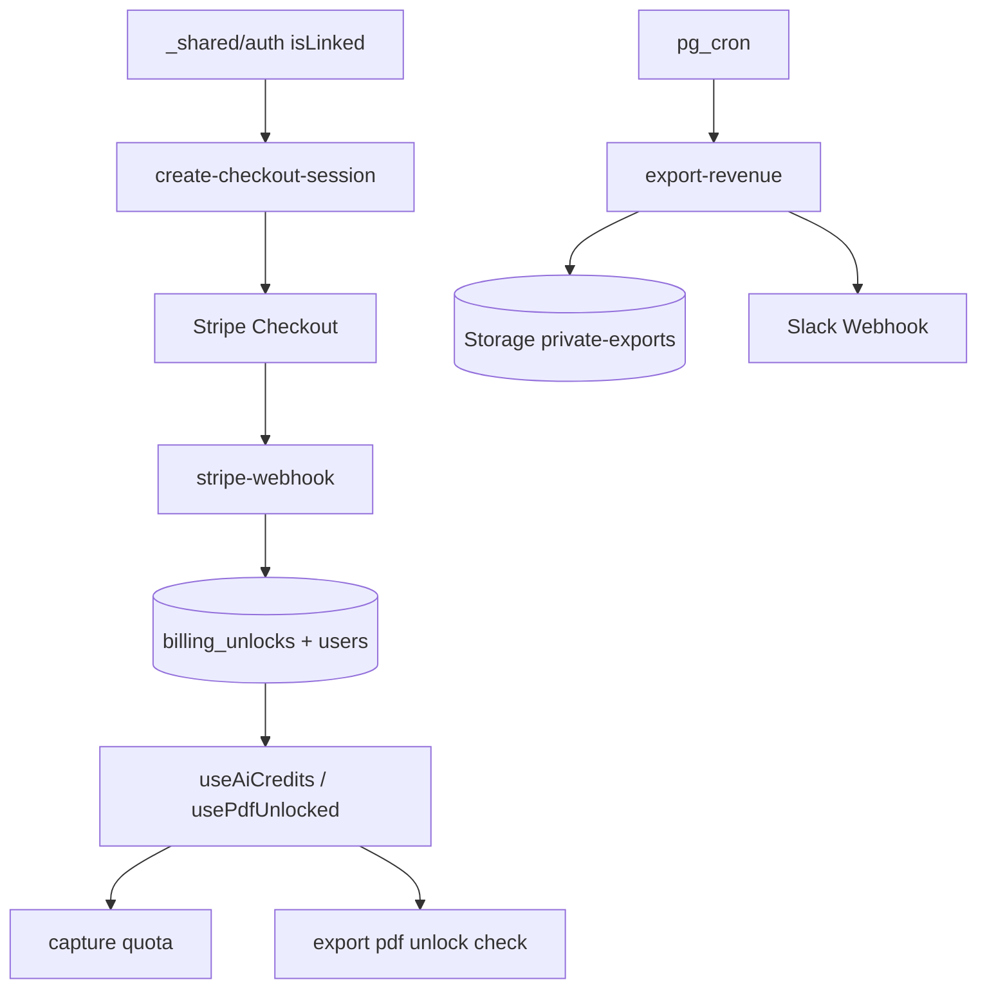

# billing 実装計画書

> **入力**: `./001_billing_SPEC.md`, `../concept.md` §4.6.4.1, charter §1
> **最終更新**: 2026-05-22

---

## 1. 実装対象ファイル一覧

### 1.1 アプリ層 (`src/features/billing/`)
| ファイル | 責務 | LOC |
|---|---|---|
| `pages/BillingPage.tsx` | 商品一覧 (AI 枠 / PDF unlock) + 過去履歴 | ~120 |
| `pages/AiCreditsPurchasePage.tsx` | 数量選択 + 購入ボタン | ~80 |
| `pages/PdfUnlockPage.tsx` | PWYW 金額入力 + 購入ボタン | ~90 |
| `pages/BillingSuccessPage.tsx` | success_url 戻り処理 | ~70 |
| `pages/BillingCancelPage.tsx` | cancel_url 戻り処理 | ~30 |
| `pages/PurchaseHistoryPage.tsx` | 履歴一覧 | ~80 |
| `components/CreditsBadge.tsx` | ヘッダ常時表示 (残 N 回) | ~40 |
| `components/OAuthRequiredModal.tsx` | E-BL-002 誘導 | ~60 |
| `hooks/useAiCredits.ts` | users.ai_credits_remaining 監視 | ~50 |
| `hooks/usePdfUnlocked.ts` | users.pdf_unlocked 監視 | ~30 |
| `hooks/useBillingHistory.ts` | billing_unlocks fetch | ~50 |
| `lib/checkoutApi.ts` | create-checkout-session ラッパ | ~60 |
| `lib/successConfirm.ts` | session_id で billing_unlocks poll | ~50 |
| `index.ts` | barrel | ~10 |

### 1.2 Edge Function (`supabase/functions/`)
| ファイル | 責務 | LOC |
|---|---|---|
| `create-checkout-session/index.ts` | type / quantity / price 受け、Stripe Session 作成 | ~120 |
| `stripe-webhook/index.ts` | Webhook 署名検証 + billing_unlocks INSERT + users 更新 | ~150 |
| `export-revenue/index.ts` | 月次集計 + CSV 生成 + Slack 通知 | ~100 |

### 1.3 マイグレーション
| ファイル | 責務 |
|---|---|
| `20260522_028_users_billing_columns.sql` | users.ai_credits_remaining int, users.pdf_unlocked bool 追加 + CHECK |
| `20260522_029_billing_unlocks_rls.sql` | RLS (SELECT 自分のみ、INSERT service_role のみ) |
| `20260522_030_storage_private_exports.sql` | bucket private-exports + admin RLS |
| `20260522_031_pg_cron_export_revenue.sql` | export-revenue を月次 cron |
| `20260522_032_admin_role.sql` | admin role 定義 (将来用、seiji のみ追加) |

## 2. 実装 Phase 分割

### Phase 1: AI 枠購入フロー (UC1)
- 含む: create-checkout-session Edge Fn, BillingPage, AiCreditsPurchasePage, BillingSuccessPage, stripe-webhook Edge Fn, useAiCredits
- ゴール: ¥100 で 20 回追加可能

### Phase 2: PDF unlock (UC2)
- 含む: PdfUnlockPage, custom_unit_amount Checkout, usePdfUnlocked
- ゴール: PWYW で PDF アンロック

### Phase 3: 履歴 + 残高表示 + OAuth 誘導
- 含む: PurchaseHistoryPage, CreditsBadge, OAuthRequiredModal
- ゴール: UI 充実

### Phase 4: 収益エクスポート (UC5、concept §4.6.4.1)
- 含む: export-revenue Edge Fn, private-exports bucket, pg_cron
- ゴール: 月次 CSV + Slack 通知

## 3. 依存関係順序

## 4. 既存ファイル影響
- `src/app/router.tsx` に `/billing/*` 追加
- `_shared/db/001_db_SPEC.md` の users / billing_unlocks 定義に追加カラム反映
- `.env.example` に追加: `STRIPE_SECRET_KEY` (Edge Fn only) / `VITE_STRIPE_PUBLISHABLE_KEY` (frontend) / `STRIPE_WEBHOOK_SECRET` / `SLACK_REVENUE_WEBHOOK_URL`
- `package.json`: `stripe` (server only, Edge Fn 経由)

## 5. 横断フォルダ追加・変更
| 横断フォルダ | 追加・変更内容 |
|---|---|
| `_shared/db/migrations/` | 028-032 追加 |
| `_shared/types/billing.ts` | BillingUnlock, CheckoutType, PurchaseHistoryEntry 型 |
| `_shared/ai/quota.ts` | users.ai_credits_remaining を参照するロジックに更新 |

## 6. リスク・注意点
- **Webhook 信頼性**: Stripe からの Webhook が届かない場合の補完 → success_url で session_id を取り Edge Fn で API 経由確認 (フォールバック)
- **べき等性**: 同じ session_id で 2 回 INSERT を防ぐ → billing_unlocks に UNIQUE(stripe_checkout_session_id) 制約
- **金額単位**: Stripe は最小通貨単位 (cent / 円)。バックエンド計算は全て円単位整数で統一、表示時のみ ¥ 区切り
- **PWYW custom_unit_amount**: Stripe では `custom_unit_amount` 機能 (Hosted Checkout) を使う、`maximum` / `minimum` / `preset` を設定
- **Receipt URL の保存**: Stripe receipt は session の charges から取得、billing_unlocks に保存
- **Webhook 順序保証なし**: 同 user の複数購入が並列に来ることあり → users UPDATE は incremental (`+= 20`) で対応
- **税対応**: Stripe Tax 未使用 (個人事業主の規模次第)、消費税は内税表示 (PRD 確認要)
- **収益 CSV の PII 除外**: ユーザー個別行を含めない、集計値のみ
- **admin role 設計**: MVP は seiji の uid のみ admin、後で multi admin 拡張可能設計に
- **Stripe test mode env**: STRIPE_SECRET_KEY を test / live で分離、dev では必ず test_*

## 7. DoD
- [ ] Stripe Checkout で ¥100 → 20 回追加 (test mode で確認)
- [ ] PDF unlock PWYW (¥500 default、500-1000 で動作)
- [ ] Webhook で billing_unlocks INSERT + users UPDATE
- [ ] success_url 戻り → 5 秒以内に UI 反映
- [ ] 二重 Webhook で重複 INSERT されない (UNIQUE 制約)
- [ ] 匿名 user で購入試行 → OAuth 誘導
- [ ] 過去履歴一覧表示
- [ ] CreditsBadge がリアルタイム更新
- [ ] export-revenue cron で CSV 生成 + Slack 通知
- [ ] vitest + Playwright (Stripe test mode) pass

## 8. 更新履歴
| 日付 | 変更概要 | 実行者 |
|---|---|---|
| 2026-05-22 | 初版作成 | /flow:feature |
