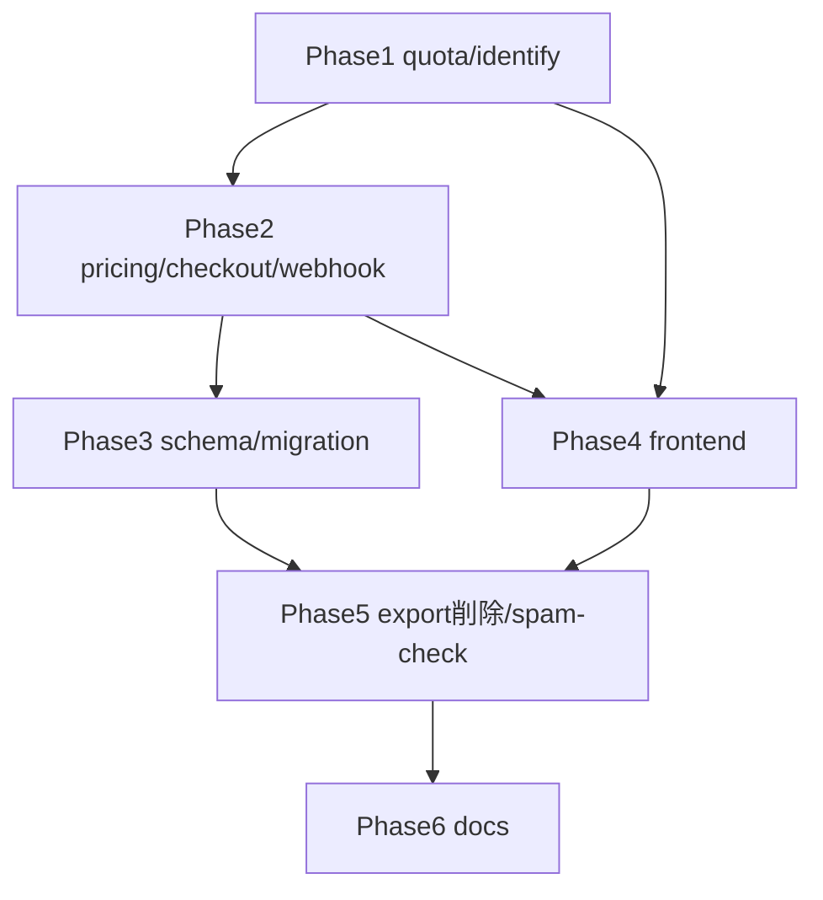

# billing 変更計画書 (ゲストトークン低価格単発課金 + pdf_unlock 全廃)

> **入力**: `./001_REVISE_SPEC.md`, `../../concept.md` §1.4 / §4.4, Step 2 で読んだ実装
> **最終更新**: 2026-05-26

---

## 1. 既存ファイル変更一覧

| ファイル | 変更内容 | リスク | 関連 SPEC § |
|---|---|---|---|
| `src/shared/ai/quota.ts` | `effectiveQuota` 匿名分岐を `trial + ai_credits_remaining` に。`mustLink` フィールド削除、消費順 trial→credits | 中 (中核ロジック、純関数なのでテスト容易) | §2.1, §7.1 |
| `api/identify-plant.ts` | `:98` `quota.mustLink ? LinkRequiredError : QuotaExceededError` → `QuotaExceededError` 一本化。`:126` LinkRequiredError→401 分岐除去 | 中 | §2.2 |
| `src/shared/ai/identify.ts` | `:47` 401→LinkRequiredError マップを除去 (identify は link_required を返さない) | 低 | §2.2 |
| `src/shared/ai/errors.ts` | `LinkRequiredError` を ai から除去 (billing 側の auth/errors の同名は別、要確認) | 低 | — |
| `api/billing/create-checkout-session.ts` | `:103` `requireLinked(isLinked)` 撤廃。`isLinked` fetch/引数が不要化したら除去。`:121` LinkRequiredError マップ除去 | 中 | §2.2 |
| `src/features/billing/pricing.ts` | `AI_CREDITS_PER_UNIT` 20→10、`AI_QTY_MAX` 10→1、`creditsFor`=10×qty、PWYW 定数 (`PWYW_MIN_JPY`/`MAX`) + `validatePwyw` 削除 | 低 | §2.1, §7.4 |
| `api/billing/stripe-webhook.ts` / `src/features/billing/webhook.ts` | `setPdfUnlocked` 分岐削除、`grantCredits` を 10×qty に。pdf_unlock イベント処理除去 | 中 (冪等性は維持) | §2.3 |
| `api/billing/status.ts` | `pdfUnlocked` / `mustLink` をレスポンスから削除 (`:19,46`) | 中 | §2.2 |
| `api/billing/confirm.ts` | pdf_unlock 参照除去 | 低 | — |
| `api/auth/spam-check.ts` | `:31` cap→`mustLink:true` を撤去 (濫用制御は guest-provision に一元化、論点-R001) | 中 (濫用制御の移譲、要テスト) | §3, 論点-R001 |
| `src/shared/db/schema.ts` | `:69` `pdfUnlocked` 列削除。`:30` enum は据え置き (dead 値) | 高 (migration) | §2.3 |
| `src/features/capture/components/QuotaModal.tsx` | trial 切れ表示を「ログインして」→「¥100 で 10 回」購入導線に。連携は任意 CTA | 中 (UX) | §7.1 |
| `src/features/billing/BillingPage.tsx` / `BillingContainer.tsx` | PWYW/PDF UI 削除、link gating 削除、¥100=10回 表示 | 中 | §2.1 |
| `src/features/billing/api.ts` / `hooks.ts` / `index.ts` | `pdf_unlock` / `link_required` / `usePdfUnlocked` 除去 | 中 | — |
| `src/features/notebook/NotebookContainer.tsx` | `:46-47` export 参照 (休眠) を除去 | 低 | §3 |
| `src/shared/types/{billing,domain,api}.ts` | `pdf_unlock` / `pdfUnlocked` / `mustLink` 型除去 | 中 (型波及) | §2.3 |
| docs: `001_billing_SPEC.md` / `002` / `004` | UC2/E-BL-002/007/PWYW を新仕様に追従 (基準 SPEC 側も更新) | 低 | — |
| `docs/concept.md` | §1.3 課金 (¥100=10回)、§5 データ (pdf_unlocked 削除)、UC3 (export) の記述更新 | 低 | — |
<!-- spec-review R1/R3: 影響範囲の列挙漏れを追補 (実コード grep)。mustLink/link_required の全 consumer を以下に追加 -->
| `src/shared/auth/trial.ts` | **mustLink の第2系統** (`TrialQuota.mustLink` + `requireTrial`→LinkRequiredError)。R3 で identify enforcement 経路 (effectiveQuota のみ使用) と分離確認 → 呼出元を Phase 1 で grep し flip/維持を判定 | 中 | R3 |
| `src/shared/auth/spam-guard.ts` | `requireTrial`→LinkRequiredError の遠隔判定。呼出元確定後に方針決定 (guest-provision 用途なら濫用制御として維持) | 中 | R2/R3 |
| `src/shared/types/api.ts` | `{ error: 'link_required' }` union メンバ。変更後の到達経路を確認し不要なら除去 (R5) | 中 | R5 |
| `src/features/billing/hooks.ts` / `api.ts` | `mustLink` DTO 露出 (hooks.ts:65,73 / api.ts:63) を除去 | 中 | R1 |
| `src/features/capture/CaptureContainer.tsx` / `CaptureButton.tsx` / `pages/CapturePage.tsx` | `linkRequired = mustLink` → reason 分岐 → QuotaModal。**reason='link_required'(連携誘導) を購入導線へ flip** (中核 UX) | 中 | R1 |

## 2. 新規ファイル一覧

| ファイル | 責務 | 依存 | LOC 見積 |
|---|---|---|---|
| `drizzle/migrations/0003_drop_pdf_unlocked.sql` (生成) | `users.pdf_unlocked` DROP COLUMN | drizzle-kit generate | ~5 |

> 原則 `npm run db:generate` で自動生成。手書きしない。

## 3. 削除ファイル一覧

| ファイル | 削除理由 | 代替 |
|---|---|---|
| `src/features/export/components/ExportDialog.tsx` (+ test) | PDF export 機能廃止 (休眠中) | なし |
| `src/features/export/hooks.ts` (+ test) | 同上 | なし |
| `src/features/export/export.ts` / `validation.ts` (`requirePdfUnlocked` 等) (+ test) | 同上 | なし |
| `src/features/export/index.ts` | 同上 | なし |
| `api/export/*` (存在すれば) | 同上 | なし |
| `src/features/billing/OAuthRequiredModal.tsx` (+ test) | 連携強制が無くなり役割消滅 | (任意連携 CTA は別) |
| `src/features/billing/components/PwywSelector.tsx` (+ test) | PWYW(PDF) 廃止 | なし |

> 削除前に「export を import している箇所」を grep し、参照ゼロを確認してから削除 (notebook の休眠参照を先に外す)。CSV エクスポートが export 機能内にある場合は、CSV を残すか PDF だけ削るかを Phase 1 で切り分ける (UC5 収益エクスポートとは別物に注意)。

## 4. マイグレーション要否

- DB スキーマ変更: ✅ (`users.pdf_unlocked` DROP) — 詳細 `005_REVISE_MIGRATION.md`
- 既存データ変換: ❌ (列削除のみ、pre-launch)
- 設定ファイル変更: ❌
- ストレージパス変更: ❌

## 5. 実装 Phase 分割 (`/dev-tdd-phase` 連携)

### Phase 1: quota コア + identify (本丸、no-DB-schema)
- 対象: `src/shared/ai/quota.ts`, `api/identify-plant.ts`, `src/shared/ai/identify.ts`, errors
- ゴール: 匿名が credits 消費可、trial+credits 枯渇=402。RED: 匿名+credits>0 で remaining>0 / consume='credits' を期待するテスト。
- `mustLink` 廃止に伴う型・参照を全解消。

### Phase 2: pricing + checkout + webhook
- 対象: `pricing.ts`, `create-checkout-session.ts`, `webhook.ts`, `stripe-webhook.ts`, `status.ts`
- ゴール: ¥100=10回・匿名購入可・付与10×。`requireLinked` 撤去。status から pdfUnlocked/mustLink 除去。

### Phase 3: schema + migration
- 対象: `schema.ts` + `npm run db:generate` → `0003_drop_pdf_unlocked.sql` → dev branch で apply 検証
- ゴール: `pdf_unlocked` 列 drop、型チェック green。

### Phase 4: frontend (購入導線 + PDF UI 削除)
- 対象: `QuotaModal`, `BillingPage/Container`, `billing/api/hooks/index`, 任意連携 CTA
- ゴール: trial 切れ→購入モーダル、PWYW/PDF UI 消滅、link gating 消滅。

### Phase 5: export 機能削除 + spam-check 整理 (論点-R001)
- 対象: `src/features/export/*`, `notebook` 参照, `spam-check.ts`
- ゴール: dead code ゼロ (knip/ts-prune)、濫用制御は guest-provision に一元化。

### Phase 6: docs 追従
- 対象: 基準 `001_billing_SPEC` 他 + concept §1.3/§5/UC3

## 6. 依存関係順序

## 7. ロールアウト計画

| ステップ | 内容 | 期日 | 検証 |
|---|---|---|---|
| 1 | ローカル: 匿名で購入(test mode)→credits 消費→継続識別 | 実装後 | 手動 + E2E |
| 2 | preview deploy + Stripe test 正常系 | preview | `/flow:e2e` |
| 3 | 本番 (実課金正常系は `/flow:release`) | release | `/flow:release` 課金チェック |

## 8. リスク・注意点

- `mustLink` の型削除は `quota.ts` / `status.ts` / `spam-check.ts` / frontend に波及 → コンパイルエラーで漏れ検出可。
- export 削除は「CSV と PDF が同一 feature に同居」している場合に CSV を巻き込まない注意 (UC5 収益エクスポートは別、運用者向け)。
- Postgres enum 値は削除しない (dead 値残置)。誤って `ALTER TYPE ... DROP VALUE` を生成しない。

## 9. 完了の定義 (DoD)

- [ ] 全 Phase 完了
- [ ] 匿名で購入→credits 消費→識別継続 が単体 + E2E で green
- [ ] `mustLink` / `pdf_unlock` / `pdfUnlocked` / PWYW の参照ゼロ (grep + ts-prune)
- [ ] `0003_drop_pdf_unlocked` を dev branch で apply・rollback 検証
- [ ] カバレッジ目標達成 (行80/分岐70)
- [ ] `/dev-review` 通過
- [ ] i18n: 購入導線の新文言が catalog 経由 (ハードコード無し)

## 10. 更新履歴
| 日付 | 変更概要 | 実行者 |
|---|---|---|
| 2026-05-26 | 初版作成 | /flow:revise |
