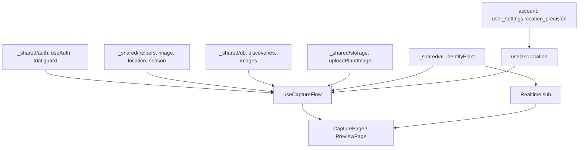

# capture 実装計画書

> **入力**: `./001_capture_SPEC.md`, `../concept.md` §1.4, `../_shared/ai/`, `../_shared/storage/`
> **最終更新**: 2026-05-22

---

## 1. 実装対象ファイル一覧 (`src/features/capture/`)

| ファイル | 責務 | 依存 | LOC |
|---|---|---|---|
| `pages/CapturePage.tsx` | 撮影ボタン + camera 起動 | useAuth, useUserSettings | ~100 |
| `pages/PreviewPage.tsx` | 撮影プレビュー + 補助メモ + 「これでよい/撮り直し」 | useImageConvert | ~150 |
| `components/CameraInput.tsx` | `<input capture>` ラッパ | (なし) | ~50 |
| `components/CaptureButton.tsx` | カメラ起動 + quota 事前 check | useQuota | ~60 |
| `components/QuotaModal.tsx` | quota 0 / link_required モーダル | navigate | ~80 |
| `hooks/useImageConvert.ts` | WebP 変換 + リサイズ + EXIF strip | _shared/helpers/image | ~50 |
| `hooks/useGeolocation.ts` | navigator.geolocation ラッパ + 100m 丸め | _shared/helpers/location | ~60 |
| `hooks/useCaptureFlow.ts` | UC1 全体 orchestration (INSERT → upload → identify) | _shared/db, _shared/storage, _shared/ai | ~150 |
| `hooks/useIdentifyStatus.ts` | Realtime sub で discovery 更新監視 | supabase realtime | ~70 |
| `lib/captureApi.ts` | createDiscovery / attachImage / triggerIdentify | _shared/db, _shared/ai | ~80 |
| `lib/retryIdentify.ts` | UC2 再識別関数 | _shared/ai | ~30 |
| `index.ts` | barrel | 全 above | ~10 |

## 2. 実装 Phase 分割

### Phase 1: 撮影 → プレビュー UI のみ
- 含む: CapturePage, PreviewPage, CameraInput, useImageConvert
- ゴール: WebP 変換まで動作、保存はまだ

### Phase 2: discovery + image INSERT + upload
- 含む: useCaptureFlow (orchestration 前半), captureApi, _shared/storage 連携
- ゴール: 「これでよい」で DB + Storage に保存される

### Phase 3: AI 識別呼出
- 含む: triggerIdentify, _shared/ai 連携
- ゴール: 識別が裏で走り、discoveries が更新される

### Phase 4: Realtime 通知 + 再識別
- 含む: useIdentifyStatus, in-app バナー, retryIdentify
- ゴール: 識別完了で notebook にバナー、UC2 動作

### Phase 5: quota / link_required UX
- 含む: QuotaModal, _shared/auth.enforceTrialLimit 連携
- ゴール: 撮影前 check + 失敗時に課金 / OAuth 誘導

## 3. 依存関係順序

## 4. 既存ファイル影響
- `src/app/router.tsx` に `/capture`, `/capture/preview` 追加
- `src/app/App.tsx` のメイン画面に CaptureButton 配置
- `package.json` に追加なし (camera は標準 API、fingerprint は auth 側)

## 5. 横断フォルダ追加・変更
| 横断フォルダ | 追加・変更内容 |
|---|---|
| `_shared/helpers/image.ts` | convertToWebP, resize, stripExif (既存設計範囲) |
| `_shared/helpers/location.ts` | roundLocation (既存) |
| `_shared/helpers/season.ts` | getCurrentSeason (既存) |
| `_shared/types/domain.ts` | `Discovery`, `DiscoveryStatus`, `Image` 型 |

## 6. リスク・注意点
- **iOS Safari の `<input capture>` 挙動**: PWA standalone モードで camera 起動できないケース → ユーザーガイドで「ホーム画面に追加」前に試す
- **EXIF GPS リーク**: helpers/image で必ず strip。テスト必須 (UNIT_TEST UT-CA-V01 で検証)
- **5MB 超過**: 4032x3024 高解像度撮影で 4-8MB は普通。リサイズ後でも超える場合は品質を下げて再エンコード
- **撮影中 OAuth 強制問題**: 撮影前に quota check、超過なら即誘導モーダル。撮影完了後に誘導すると画像が宙ぶらりんに
- **Realtime 接続失敗**: モバイル 4G の WebSocket 切断対策 → 5s ごとに poll fallback
- **同時撮影**: 1 user が複数タブで連射 → race で同 discovery が複数 INSERT される可能性 → client-side で uuid v7 を事前生成 (アプリ層で先出し)
- **discovery 作成 → AI 失敗で Storage 残骸**: Edge Function で identify 失敗時も discovery は pending で残す方針なので Storage object も残す (notebook 詳細で見れる)
- **撮影 cancel 時の Storage cleanup**: プレビュー段階 (Phase 1) では Storage 未 upload なので問題なし、Phase 2 以降の中断は discovery=identifying 状態で残るが cron で 24h 経過した identifying は pending 化する補正バッチを別途検討

## 7. DoD
- [ ] camera 起動 → 撮影 → プレビュー → 「これでよい」 → discovery INSERT 確認
- [ ] Storage に WebP がアップロードされる
- [ ] identify-plant Edge Function が呼ばれ、結果が DB に反映される
- [ ] Realtime バナー or poll fallback で識別完了通知
- [ ] 再識別ボタンで pending → identifying → 結果反映
- [ ] quota 0 で課金画面遷移
- [ ] 匿名 trial 超過で OAuth 誘導
- [ ] EXIF GPS が完全に strip されている
- [ ] vitest + Playwright pass

## 8. 更新履歴
| 日付 | 変更概要 | 実行者 |
|---|---|---|
| 2026-05-22 | 初版作成 | /flow:feature |
