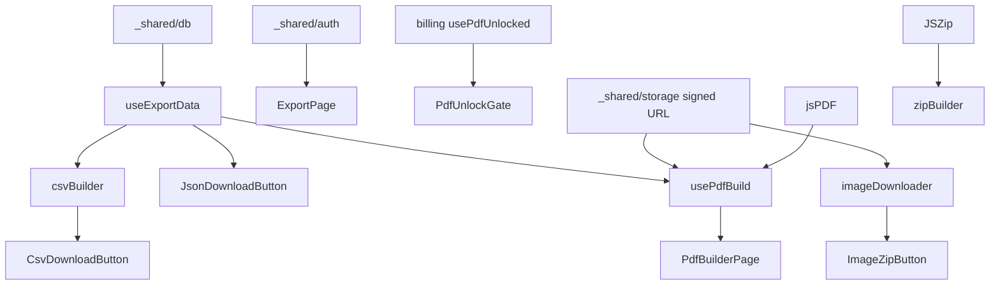

# export 実装計画書

> **入力**: `./001_export_SPEC.md`, `../concept.md` §4.7.5
> **最終更新**: 2026-05-22

---

## 1. 実装対象ファイル一覧 (`src/features/export/`)

| ファイル | 責務 | LOC |
|---|---|---|
| `pages/ExportPage.tsx` | エクスポートメニュー + 状態管理 | ~100 |
| `pages/PdfBuilderPage.tsx` | PDF プレビュー + 設定 + 生成ボタン | ~150 |
| `components/PdfPreview.tsx` | プレビュー (画面上) | ~120 |
| `components/PdfUnlockGate.tsx` | unlock 未取得時の billing 誘導 | ~50 |
| `components/CsvDownloadButton.tsx` | 4 種 CSV を ZIP | ~80 |
| `components/JsonDownloadButton.tsx` | JSON エクスポート | ~50 |
| `components/ImageZipButton.tsx` | 画像 ZIP + プログレス | ~150 |
| `components/Progress.tsx` | 共通プログレス | ~40 |
| `hooks/usePdfBuild.ts` | jsPDF + html2canvas オーケストレーション | ~200 |
| `hooks/useExportData.ts` | discoveries / edits / consent / billing 一括 fetch | ~80 |
| `lib/pdfRenderer.ts` | ページレイアウト (表紙 / grid / 統計) 純粋関数 | ~250 |
| `lib/csvBuilder.ts` | rows → CSV string (UTF-8 BOM) | ~80 |
| `lib/zipBuilder.ts` | JSZip ラッパ | ~50 |
| `lib/imageDownloader.ts` | 並列 fetch + Blob 化 | ~100 |
| `index.ts` | barrel | ~10 |

## 2. 実装 Phase 分割

### Phase 1: CSV エクスポート (UC2)
- 含む: useExportData, csvBuilder, zipBuilder, CsvDownloadButton
- ゴール: 全データ CSV ZIP ダウンロード

### Phase 2: JSON エクスポート (UC3)
- 含む: JsonDownloadButton
- ゴール: 同上を JSON で

### Phase 3: PDF 生成 (UC1)
- 含む: PdfBuilderPage, usePdfBuild, pdfRenderer, PdfPreview, PdfUnlockGate
- ゴール: PWYW unlock 済 user が PDF DL

### Phase 4: 画像 ZIP (UC4)
- 含む: ImageZipButton, imageDownloader, Progress
- ゴール: 画像一括 DL with プログレス

## 3. 依存関係順序

## 4. 既存ファイル影響
- `src/app/router.tsx` に `/export`, `/export/pdf` 追加
- `account/SettingsPage.tsx` の「データ管理」section に export リンク追加
- `package.json`: `jspdf`, `html2canvas`, `jszip` 追加

## 5. 横断フォルダ追加・変更
| 横断フォルダ | 追加・変更内容 |
|---|---|
| `_shared/types/domain.ts` | ExportFormat, PdfLayout 型 |
| `_shared/helpers/date.ts` | formatPeriod 等のヘルパ |

## 6. リスク・注意点
- **クライアント PDF メモリ**: jsPDF + html2canvas は 50 件で ~200MB、モバイル Safari でクラッシュリスク → 件数制限 + 進捗表示 + 「件数を減らす」ガイド
- **画像 fetch の Storage 課金**: 大量 fetch でも Free 範囲内 (bandwidth 5GB/月)、超過 alert は analytics
- **CSV 文字化け**: Excel UTF-8 を直接読めない問題 → BOM (``) を先頭付加
- **ZIP 内ファイル名の日本語**: JSZip + Shift-JIS 問題 → ASCII でファイル名統一 (`discoveries.csv` 等)
- **PWYW unlock 不正アクセス**: フロントの pdf_unlocked 改竄でも、Storage / DB は影響なし (export はクライアント側 fetch のみ)。とはいえ DB 側で `pdf_unlocked=true` 必須にすると EU 法的に問題 (撤退時の export は必須) → CSV/JSON/画像は無料、PDF のみ unlock 必須
- **削除予約 user**: deleted_at set 時は export ボタン disable (DeletionPendingGate)
- **JSON エクスポートの個人情報**: フル export は user の所有データのみ、user_id 等は含めない (UX 配慮)
- **画像 ZIP のメモリ**: 100 件 (50MB) で OK だが 1000 件で 500MB → 100 件ずつ chunk 化、cancel ボタンで中断可能に

## 7. DoD
- [ ] CSV ZIP DL (discoveries + edits + consent + billing 4 種)
- [ ] JSON DL (構造化された同データ)
- [ ] PDF unlock なしで「アンロックする」 → billing 誘導
- [ ] PDF unlock 済で 50 件 PDF が < 30s 生成
- [ ] 画像 ZIP DL (100 件) with プログレス
- [ ] cancel で中断可能
- [ ] 削除予約 user は export 不可 (UI disable)
- [ ] CSV が Excel で文字化けしない (BOM 付き)
- [ ] vitest + Playwright pass

## 8. 更新履歴
| 日付 | 変更概要 | 実行者 |
|---|---|---|
| 2026-05-22 | 初版作成 | /flow:feature |
