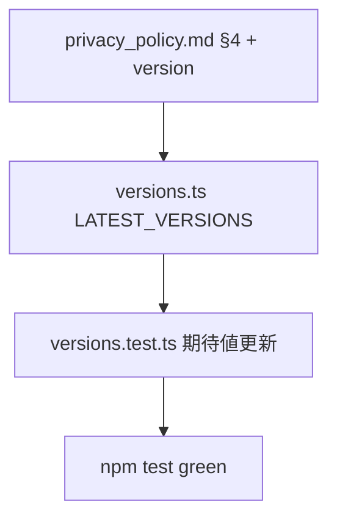

# legal 変更計画書（プライバシーポリシー Sentry PII スクラブ開示の明記）

> **入力**: `./001_REVISE_SPEC.md`, `../../concept.md` §9, Step 2 で読んだ `privacy_policy.md` / `versions.ts`
> **最終更新**: 2026-05-24

---

## 1. 既存ファイル変更一覧

| ファイル | 変更内容（概要） | リスク | 関連 SPEC § |
|---|---|---|---|
| `docs/legal/privacy_policy.md` | §4 エラー監視行に PII スクラブ後送信を追記 + バージョン v1.0.0→v1.1.0 + 最終更新 2026-05-24 | 低 | §2.2 |
| `src/features/legal/versions.ts` | `LATEST_VERSIONS.privacy_policy` `v1.0.0`→`v1.1.0` | 低 | §2.4 |
| `src/features/legal/versions.test.ts` | LATEST_VERSIONS 期待値テストがあれば v1.1.0 に更新 (なければ不要) | 低 | §2.4 |

## 2. 新規ファイル一覧
| ファイル | 責務 | 依存 | LOC 見積 |
|---|---|---|---|
| (なし) | — | — | — |

## 3. 削除ファイル一覧
| ファイル | 削除理由 | 代替 |
|---|---|---|
| (なし) | — | — |

## 4. マイグレーション要否
- DB スキーマ変更: ❌
- 既存データ変換: ❌ (`consent_logs` は将来同意時に v1.1.0 を記録するのみ)
- 設定ファイル変更: ❌
- ストレージパス変更: ❌
- → MIGRATION 不要

## 5. 実装 Phase 分割（/dev-tdd-phase 連携）

### Phase 1 (RED→GREEN→IMPROVE): プラポリ本文 + バージョン定数
- 対象: `privacy_policy.md` §4 + version header、`versions.ts` LATEST_VERSIONS
- 手順: §4 文言追記 → version bump (md + versions.ts) → `versions.test.ts` 期待値更新 (該当時) → `npm test` green
- ゴール: 全 Vitest green 維持、`needsReConsent` が v1.0.0→v1.1.0 を再同意要求と判定

## 6. 依存関係順序

## 7. ロールアウト計画
| ステップ | 内容 | 期日 | 検証方法 |
|---|---|---|---|
| 1 | 文言 + version 更新 | Phase 4 前 | `npm test` |
| 2 | α 公開前に法務知見者レビュー (concept §9.3) | α 前 | 目視 |

## 8. リスク・注意点
- §10 改訂条項により version bump 後の公開で再同意ダイアログが出る (pre-α で実害なし)
- 文言は法務知見者レビュー推奨 (個人情報保護法の委託先記載の正確性)

## 9. 完了の定義 (DoD)
- [ ] privacy_policy.md §4 に PII スクラブ開示 + v1.1.0
- [ ] versions.ts LATEST_VERSIONS.privacy_policy = v1.1.0
- [ ] 全 Vitest green
- [ ] [論点-014] 法務 TODO (プラポリ開示部分) 消化

## 10. 更新履歴
| 日付 | 変更概要 | 実行者 |
|---|---|---|
| 2026-05-24 | 初版作成 | /flow:revise (D20260524_046) |
