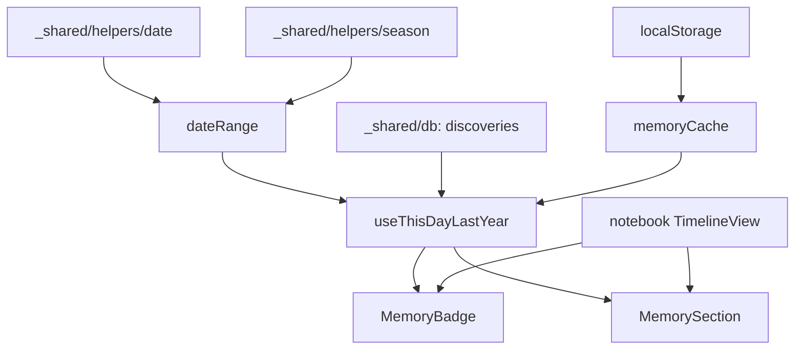

# memory 実装計画書

> **入力**: `./001_memory_SPEC.md`, `../notebook/`
> **最終更新**: 2026-05-22

---

## 1. 実装対象ファイル一覧 (`src/features/memory/`)

| ファイル | 責務 | LOC |
|---|---|---|
| `components/MemoryBadge.tsx` | notebook ヘッダ右上のバッジ (件数表示 + タップ) | ~60 |
| `components/MemorySection.tsx` | 「去年の今頃」横スクロールカルーセル | ~120 |
| `components/MemoryCard.tsx` | 個別カード (画像 + name + 場所 + リンク) | ~50 |
| `hooks/useThisDayLastYear.ts` | 前年同期間 fetch + キャッシュ | ~80 |
| `lib/dateRange.ts` | 前年同期間 (±15 日) 計算 | ~40 |
| `lib/memoryCache.ts` | localStorage キャッシュ (TTL 24h) | ~50 |
| `index.ts` | barrel | ~10 |

## 2. 実装 Phase 分割

### Phase 1: dateRange + useThisDayLastYear (data 層)
- 含む: dateRange, memoryCache, useThisDayLastYear
- ゴール: 前年 ±15 日の identified discoveries を fetch

### Phase 2: UI 統合 (notebook 側)
- 含む: MemoryBadge, MemorySection, MemoryCard
- ゴール: notebook で表示

## 3. 依存関係順序

## 4. 既存ファイル影響
- `src/features/notebook/components/TimelineView.tsx` に MemorySection を最上部マウント (props で件数 0 なら表示なし)
- `src/features/notebook/pages/NotebookPage.tsx` ヘッダに MemoryBadge

## 5. 横断フォルダ追加・変更
| 横断フォルダ | 追加・変更内容 |
|---|---|
| `_shared/helpers/date.ts` | `getLastYearRange(date, marginDays)` 関数追加 |
| `_shared/types/domain.ts` | MemoryItem 型 (Discovery の subset) |

## 6. リスク・注意点
- **キャッシュ TTL**: 日付跨ぎで再計算が必要 → key に日付を含める (`memory_2026-05-22`)
- **タイムゾーン**: ユーザー TZ で計算 (UTC ではない)。サーバー側 query には UTC で変換
- **南半球対応 ([論点-008] 連携)**: season 判定が helpers/season で南半球対応されているか確認 (現状は北半球前提、論点として残置)
- **件数表示**: バッジに「99+」表記 (3 桁以上で省略)
- **画像 fetch 最適化**: カード 5 枚分のみ署名 URL fetch、無駄なリクエスト避ける
- **押し付けない原則 (charter §2.2)**: 0 件で CTA 出さない、バッジも非表示で空白を尊重
- **a11y**: バッジは aria-label「去年の今頃 N 件」、セクション見出し h2

## 7. DoD
- [ ] 前年 ±15 日 + season 一致 で discoveries fetch
- [ ] 件数 >= 1 でバッジ表示
- [ ] 0 件でバッジ + セクション非表示
- [ ] カルーセルで横スクロール
- [ ] カード → 詳細遷移
- [ ] キャッシュが 24h で expire
- [ ] vitest + Playwright pass

## 8. 更新履歴
| 日付 | 変更概要 | 実行者 |
|---|---|---|
| 2026-05-22 | 初版作成 | /flow:feature |
