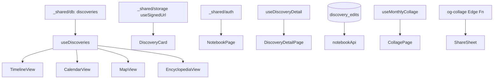

# notebook 実装計画書

> **入力**: `./001_notebook_SPEC.md`, `../concept.md` §1.4, §4.8.2
> **最終更新**: 2026-05-22

---

## 1. 実装対象ファイル一覧 (`src/features/notebook/`)

| ファイル | 責務 | LOC |
|---|---|---|
| `pages/NotebookPage.tsx` | 4 モードの container + モードタブ | ~120 |
| `pages/DiscoveryDetailPage.tsx` | 詳細表示 + 編集 + 削除 | ~200 |
| `pages/CollagePage.tsx` | 月次コラージュ生成 + シェア | ~150 |
| `components/TimelineView.tsx` | タイムライン表示 + 無限スクロール | ~100 |
| `components/CalendarView.tsx` | 月カレンダー + マーカー | ~120 |
| `components/MapView.tsx` | 地図 + ピン (MapLibre + OpenStreetMap) | ~150 |
| `components/EncyclopediaView.tsx` | scientific_name 別グルーピング | ~80 |
| `components/DiscoveryCard.tsx` | サムネカード共通部品 | ~60 |
| `components/FilterDrawer.tsx` | フィルタ UI | ~120 |
| `components/EditForm.tsx` | 詳細編集フォーム | ~100 |
| `components/CollageCanvas.tsx` | canvas で 9 グリッド合成 | ~150 |
| `components/ShareSheet.tsx` | Web Share API + SNS リンク fallback | ~80 |
| `hooks/useDiscoveries.ts` | filter + pagination 統合 | ~120 |
| `hooks/useDiscoveryDetail.ts` | 単一 discovery fetch | ~50 |
| `hooks/useMonthlyCollage.ts` | 前月データ集計 + canvas 生成 | ~100 |
| `lib/notebookApi.ts` | update / softDelete / logEdit RPC | ~80 |
| `lib/collageRenderer.ts` | canvas レンダリング純粋関数 | ~150 |
| `lib/urlParams.ts` | フィルタ ↔ URL 同期 | ~50 |
| `index.ts` | barrel | ~10 |

## 2. Edge Function (`supabase/functions/og-collage/`)
| ファイル | 責務 |
|---|---|
| `index.ts` | コラージュ id から動的 OG 画像生成 (Vercel OG + Satori) |

## 3. マイグレーション
| ファイル | 責務 |
|---|---|
| `20260522_026_discoveries_user_override.sql` | discoveries に original_common_name / user_overridden_name / deleted_at 追加 |
| `20260522_027_discovery_edits.sql` | discovery_edits テーブル + RLS |

## 4. 実装 Phase 分割

### Phase 1: タイムライン + DiscoveryCard
- 含む: NotebookPage, TimelineView, DiscoveryCard, useDiscoveries (basic)
- ゴール: 自分の discovery が並ぶ

### Phase 2: 詳細 + 編集 + 削除
- 含む: DiscoveryDetailPage, EditForm, notebookApi, discovery_edits マイグ
- ゴール: 編集が記録される

### Phase 3: フィルタ + URL 同期
- 含む: FilterDrawer, urlParams
- ゴール: deep link 可能

### Phase 4: 他モード (カレンダー / 地図 / 図鑑)
- 含む: CalendarView, MapView (MapLibre), EncyclopediaView
- ゴール: モード切替で別ビュー

### Phase 5: 月次コラージュ + シェア
- 含む: CollagePage, CollageCanvas, ShareSheet, useMonthlyCollage, og-collage Edge Function
- ゴール: UGC 流出設計 (concept §4.8.2)

## 5. 依存関係順序

## 6. 既存ファイル影響
- `src/app/router.tsx` に `/notebook`, `/notebook/:id`, `/notebook/collage/:yyyymm` 追加
- `_shared/db/001_db_SPEC.md` discoveries テーブル定義 更新 (override カラム + soft delete)
- `package.json`: `maplibre-gl`, `satori`, `@vercel/og` 追加検討
- `_shared/types/domain.ts` に Discovery / DiscoveryEdit 型追加

## 7. 横断フォルダ追加・変更
| 横断フォルダ | 追加・変更内容 |
|---|---|
| `_shared/db/migrations/` | 026, 027 追加 |
| `_shared/types/domain.ts` | DiscoveryEdit, FilterParams 型 |
| `_shared/helpers/url.ts` | (新規) parseFilter / buildFilter |

## 8. リスク・注意点
- **MapLibre + OpenStreetMap タイル**: 無料利用規約に従う必要 (大規模なら独自タイルサーバ検討)。MVP は OK
- **地図のピン数**: 100 件超でパフォーマンス劣化 → クラスタリング (maplibre-gl-supercluster)
- **コラージュ canvas メモリ**: 9 画像 × 1080px は ~36MB → モバイル Safari でクラッシュ可能、解像度を 720x720 にフォールバック検討
- **OG 画像 Edge Function**: Vercel OG は Edge runtime、cold start 200ms、画像 fetch も含めると 1s 程度
- **discovery_edits append-only**: RLS で UPDATE/DELETE 禁止、test 必須
- **soft delete + RLS**: SELECT 時に `deleted_at IS NULL` を常に付ける → ヘルパ関数化
- **シェア URL 推測対策**: id は uuid v4 (128 bit) を使用、enumerate 不可
- **i18n**: UI 文字列は t.* catalog 経由、ハードコード禁止 (CLAUDE.md 規則)

## 9. DoD
- [ ] タイムライン無限スクロール動作
- [ ] 4 モード切替が 300ms 以内
- [ ] フィルタが URL に反映、deep link で復元
- [ ] 詳細編集が discovery_edits にログされる
- [ ] discovery_edits の UPDATE が RLS で拒否される
- [ ] 月次コラージュが 5s 以内に生成
- [ ] Web Share API で X / FB / コピー URL 動作
- [ ] OG 画像が動的に表示される
- [ ] soft delete → 30 日後 cron で完全削除確認
- [ ] vitest + Playwright pass

## 10. 更新履歴
| 日付 | 変更概要 | 実行者 |
|---|---|---|
| 2026-05-22 | 初版作成 | /flow:feature |
